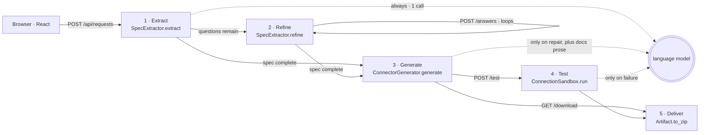
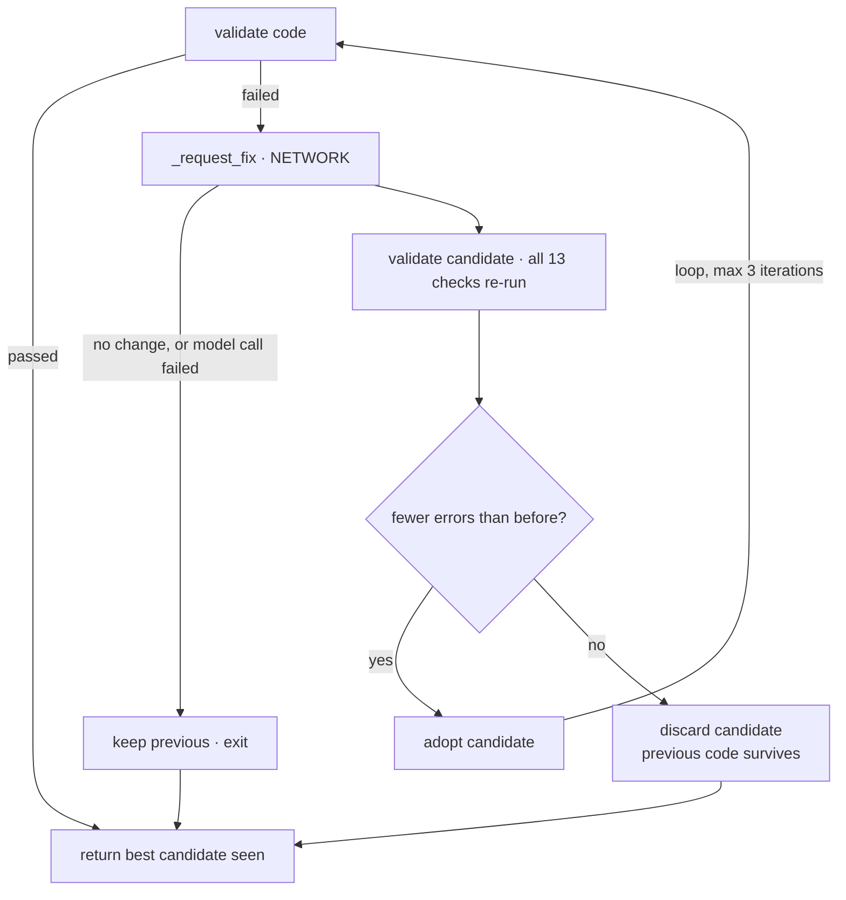
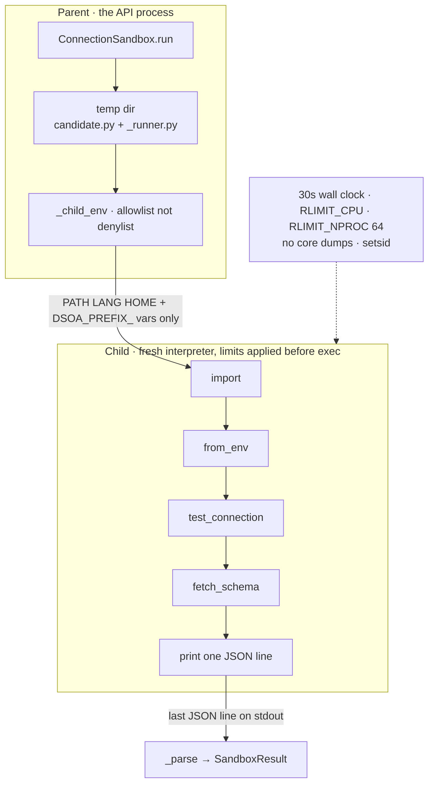

# Execution Map

What runs, in what order, calling what — from the browser to a downloadable zip,
at function-call resolution.

Traced against the source rather than written from memory. Line numbers drift as
the code moves; **the call order is the durable part**.

Legend used throughout:

| mark | meaning |
| --- | --- |
| `← NETWORK` | a call to the language model |
| `← SUBPROCESS` | a child process is spawned |
| `→ exit` | this path stops the stage and returns |

---

## The shape of the whole thing

Five HTTP endpoints, five stages. A request accumulates state in one in-memory
object and moves forward only when the previous stage produced what the next one
needs.

The useful thing to notice first: **only three of the five stages can talk to the
model, and two of those only when something has gone wrong.**



Refine and Deliver never call the model. Generation is blocked until the draft
has no open questions.

---

## Step 0 — boot

Before any request arrives, `create_app()` constructs every collaborator once and
closes over them. No DI container, no per-request construction: the same objects
serve every request for the life of the process.

```
uvicorn dsoa.api.main:app
└─ create_app()                              api/main.py:309
   ├─ build_llm_client()                     api/main.py:240
   │  picks the first key present, in this order:
   │  └─ DeepseekClient │ AnthropicClient │ GeminiClient │ ScriptedClient
   │     no key → ScriptedClient, canned payloads, same interface
   ├─ RequestStore()                         api/main.py:81    dict, not a database
   ├─ SpecExtractor(client)                  agent/extractor.py:82
   ├─ ConnectorGenerator(repair_client=…)    generation.py:73
   │  ├─ ConnectorRenderer(registry)         templates/renderer.py:63
   │  │  └─ TemplateRegistry()               templates/registry.py:110
   │  │     └─ _sql_entries()  ← reads sources.json, builds DIALECTS
   │  ├─ StaticValidator()                   validation/static.py:37
   │  └─ RepairLoop(client, validator, max_iterations=3)
   │                                         validation/repair.py:111
   ├─ DocsGenerator(client)                  docs_gen/generator.py:64
   ├─ ArtifactPackager()                     artifacts/packager.py:73
   └─ ConnectionSandbox()                    sandbox/runner.py:129
      timeout=30s, memory=512MB
```

> **Consequence worth knowing.** `RequestStore` is a dict in process memory.
> Restart uvicorn and every request, connector and artifact is gone. That is a
> deliberate choice documented at the top of `api/main.py` — but it means the
> sidebar history is per-process, and two workers would not see each other's
> requests.

---

## Stage 1 — extract

Triggered by the send button. Browser side: `InputBar` →
`useOnboarding.submitPrompt()` → `api.createRequest()` → the endpoint.

```
create_request(body)                                api/main.py:348
├─ store.create(prompt)                             api/main.py:87
│     → OnboardingRequest(id=uuid4().hex[:12], status="extracted")
├─ extractor.extract(prompt)                        agent/extractor.py:96
│  ├─ scrub(prompt)                                 agent/security.py:132
│  │     truncates over-long input, redacts credentials, flags
│  │     instruction-like text → ScrubResult(cleaned, findings)
│  ├─ self._call_model(scrubbed)                    agent/extractor.py:191
│  │  ├─ wrap_untrusted(cleaned)                    agent/security.py:182
│  │  │     fences the text as data, not instructions
│  │  ├─ extraction_tool_schema()                   agent/prompts.py
│  │  └─ client.complete_json(…)                    agent/llm.py:85  ← NETWORK
│  │        tool_name="emit_source_spec" — schema-enforced,
│  │        not "reply with JSON and hope"
│  │     on LLMError → caught at extractor.py:122
│  │        → ExtractionResult(confidence=0.0, 1 question)  — never raises
│  ├─ self._build_draft(payload, notes)             agent/extractor.py:199
│  │     one bad enum costs that field, not the whole extraction:
│  │     ValidationError → drop the named field → retry once → SpecDraft()
│  ├─ draft.apply_defaults()                        agent/spec.py:360
│  │     fills conventions (port 5432 …), each recorded in assumed_fields
│  └─ build_questions(draft, max_questions=3)       agent/clarify.py:115
│        templated question library — not model-authored
├─ request.prompt = extraction.scrubbed_prompt      api/main.py:362
│     the stored copy is the redacted one, so a pasted password
│     cannot come back out of any later response
└─ _request_payload(request)                        api/main.py:213
   ├─ _extraction_payload()  ├─ _connector_payload()  └─ _sandbox_payload()
```

Status becomes `needs_clarification` when questions came back, otherwise
`extracted`. The React side appends an `ExtractionCard`, plus a `QuestionsCard`
when there are questions.

---

## Stage 2 — refine

The cheapest stage, and deliberately so.

```
submit_answers(id, body)                            api/main.py:382
├─ store.get(id)                                    api/main.py:96  → 404 if unknown
├─ 409 if request.extraction is None                → exit
├─ extractor.refine(draft, answers)                 agent/extractor.py:166
│  ├─ apply_answers(draft, answers)                 agent/clarify.py:149
│  ├─ .apply_defaults()                             agent/spec.py:360
│  └─ build_questions(updated, max_questions=3)     agent/clarify.py:115
│        confidence = 1.0 if nothing left to ask, else 0.7
└─ _request_payload(request)
```

**No model call.** Answers map onto named fields, so folding them in is
arithmetic rather than inference. A second extraction pass could re-read — and
re-misread — a field the user already settled by hand. Skipping the model here
removes a class of regression where answering one question unsettles another.

---

## Stage 3 — generate

The longest chain in the project. Note where the model is *not*: it never writes
the connector.

```
generate(request_id)                                api/main.py:396
├─ 409 unless draft.is_complete                     → exit
├─ request.draft.finalize()                         agent/spec.py → strict SourceSpec
│     ValidationError → 400 with per-field messages → exit
├─ generator.generate(spec)                         generation.py:93
│  ├─ renderer.render(spec)                         templates/renderer.py:85
│  │  ├─ registry.get(spec.template_key)            templates/registry.py:118
│  │  │     "postgresql:username_password" → sql_connector.py.j2 v1.0.0
│  │  │     unknown key → ConfigurationError → 400 listing supported keys
│  │  ├─ spec_checksum(spec)                        templates/renderer.py:53
│  │  └─ template.render(spec, dialect, meta)
│  │        ← THE CODE IS WRITTEN HERE, BY JINJA2
│  ├─ validator.validate(rendered.code)             validation/static.py:53
│  │  ├─ run_checks(source)                         standards/checks.py:445
│  │  │  ├─ ast.parse(source)   parsed, never imported
│  │  │  │     SyntaxError → early return; nothing else can run
│  │  │  └─ for name, check in ALL_CHECKS:   ← the 13 rules
│  │  │        no-hardcoded-credentials, no-dynamic-sql, env-for-secrets,
│  │  │        no-dangerous-calls, type-hints, docstrings, …
│  │  ├─ self._ruff(exe, path)                      static.py:118  ← SUBPROCESS
│  │  ├─ self._black(exe, path)                     static.py:156  ← SUBPROCESS
│  │  └─ self._bandit(exe, path)                    static.py:182  ← SUBPROCESS
│  │        tool not installed → tools_skipped, a warning, not a failure
│  └─ if not report.passed: repair.run(code, report)
│                                                   validation/repair.py:125
├─ docs_generator.generate(connector)               docs_gen/generator.py:83
│  ├─ readme(artifact)         README.md.j2, lists the checks that passed
│  ├─ requirements(artifact)   driver package from the dialect profile
│  └─ explain(artifact)                             docs_gen/generator.py:142
│     └─ client.complete_json(…)                    ← NETWORK, prose only
│           no client, or it fails → _fallback_explanation(), tagged
│           "template"; the UI shows which one you are reading
├─ packager.package(connector, docs, sandbox_result)
│                                                   artifacts/packager.py:76
│     → 5 files + manifest{source, provenance, validation,
│       connectivity, required_env}
└─ status = "generated" if connector.accepted else "rejected"
```

### The repair loop



`RepairLoop.run()`, `validation/repair.py:125`. The guard is the point: a
candidate is adopted only if it **strictly** reduces the error count. The
returned code is never worse than the input.

---

## Stage 4 — test

The one place in the project that *executes* generated code. Everything upstream
only reads its AST.

```
test_connection(request_id, body)                   api/main.py:436
├─ 409 unless a connector exists                    → exit
└─ for attempt in 1..3:
   ├─ sandbox.run(code, spec, body.credentials)     sandbox/runner.py:141
   │  ├─ tempdir ← candidate.py + _runner.py
   │  ├─ self._child_env(spec, credentials)         sandbox/runner.py:224
   │  │     allowlist: PATH LANG LC_ALL PYTHONPATH HOME
   │  │     + only vars starting with spec.auth.env_prefix
   │  │     a credential with the wrong prefix is dropped and logged
   │  ├─ subprocess.run([python, _runner.py, …], timeout=30)  ← SUBPROCESS
   │  │  └─ CHILD: import → getattr(cls) → from_env()
   │  │            → test_connection() → fetch_schema()
   │  │            → prints ONE json line
   │  ├─ TimeoutExpired → SandboxResult(timed_out=True)
   │  └─ self._parse(stdout)                        sandbox/runner.py:270
   │        reads the LAST json line — a driver may print warnings first
   ├─ if result.success: break
   └─ repair_sandbox_error(client, code, type, msg, tb)
      │                                             validation/repair.py:247
      └─ client.complete_json(…)                    ← NETWORK
         └─ dataclasses.replace(connector, code=new_code) → retry
then, regardless of outcome:
├─ docs_generator.generate(connector)   docs re-made for the repaired code
└─ packager.package(connector, docs, result)
      manifest now records connectivity
```

### The sandbox boundary



Any exception inside the child is caught and reported as a value, not raised —
the repair loop and the UI both need to read it.

The environment is an **allowlist**, so a secret added to the parent later is not
exposed by default. What this does *not* give you is kernel isolation; the module
docstring says so plainly, and for production the same runner goes inside a
container.

---

## Stage 5 — deliver

```
download(request_id)                                api/main.py:481
├─ 409 if request.artifact is None                  → exit
└─ request.artifact.to_zip()                        artifacts/packager.py:47
      ZipInfo(date_time=(2026,1,1,0,0,0)) — fixed, not the clock
      → packaging the same artifact twice produces identical bytes
```

The browser reaches this through a plain `<a href download>` rather than
`fetch()`, so the zip streams to disk with the filename the API sets in
`Content-Disposition`.

---

## Where each stage can stop

Failure is a first-class outcome nearly everywhere — the UI has to render it, so
it travels as data rather than as an exception.

| Stage | Stops when | What the caller gets |
| --- | --- | --- |
| Extract | Model call fails | `200` · confidence 0.0, one question, the error as a note |
| Refine | Nothing extracted yet | `409` · "Nothing extracted yet" |
| Generate | Draft incomplete | `409` · answer the outstanding questions first |
| Generate | `finalize()` rejects a field | `400` · per-field messages |
| Generate | No template for the key | `400` · with the supported keys listed |
| Generate | Still failing after 3 repairs | `200` · `accepted=false`, findings in the Standards tab |
| Test | No connector yet | `409` · generate first |
| Test | Child times out or crashes | `200` · `SandboxResult(success=false)` with the stage it died at |
| Download | Nothing packaged | `409` · no artifact yet |

---

## The browser half

The React app never holds derived state — the server payload is the source of
truth, and the chat thread is a log of how it was reached.

```
InputBar.onSubmit                       frontend/src/components/chat/InputBar.tsx
└─ useOnboarding.submitPrompt()         frontend/src/hooks/useOnboarding.ts
   ├─ append user message
   ├─ api.createRequest(text)           frontend/src/api/client.ts
   │  └─ POST /api/requests
   ├─ setRequest(payload)               ← the whole server object, replaced
   └─ appendExtraction(payload)
      └─ ExtractionCard + QuestionsCard rendered from it
```

`generate`, `submitAnswers` and `test` follow the identical shape: call the API,
replace the request object, append the bubbles that describe what came back.
Reopening a request from the sidebar calls `replay()`, which rebuilds a thread
from stored state — the backend stores state, not conversation.
